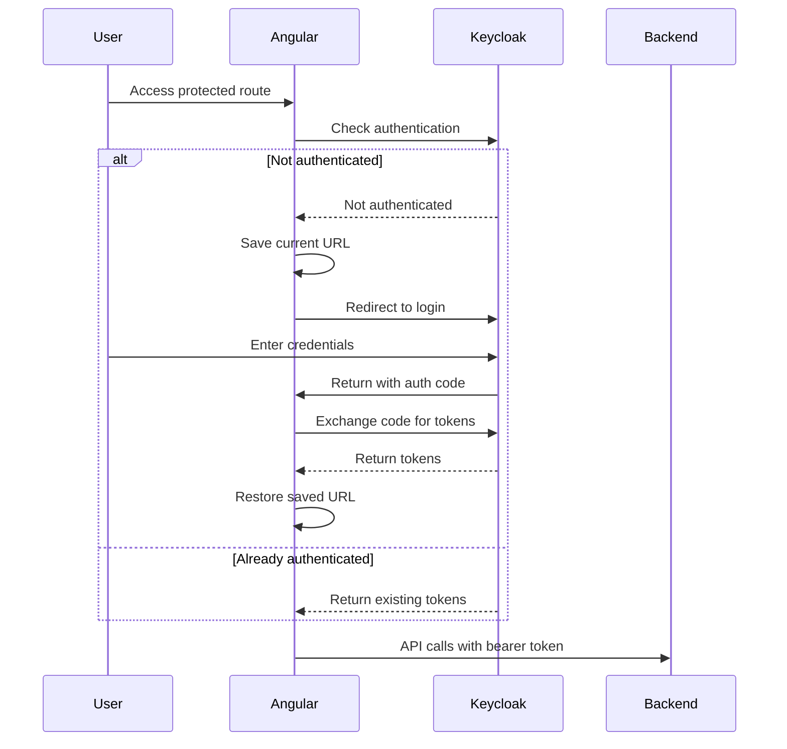

# Login Flow Documentation

## Overview

This document describes the authentication flow between the Angular frontend application and Keycloak, with the Spring Boot backend acting as a configuration provider and resource server.

## Flow Description

### 1. Initial Configuration

The frontend application starts by fetching the Keycloak configuration from the backend:

```typescript
// main.ts
const response = await fetch('http://localhost:8080/api/auth/config');
const config = await response.json();
// Returns: { authServerUrl, realm, clientId }
```

### 2. Keycloak Initialization

Once the configuration is received, the Keycloak client is initialized with:
- Silent SSO check enabled
- PKCE (Proof Key for Code Exchange) for enhanced security
- Token refresh automation
- User activity monitoring

```typescript
provideKeycloak({
  config: {
    url: authConfig.authServerUrl,
    realm: authConfig.realm,
    clientId: authConfig.clientId,
  },
  initOptions: {
    onLoad: 'check-sso',
    silentCheckSsoRedirectUri: '/assets/silent-check-sso.html',
    pkceMethod: 'S256'
  }
})
```

### 3. Silent SSO Check

The application performs a silent SSO check using an invisible iframe to:
- Check if the user has an active Keycloak session
- Avoid full page reloads
- Maintain application state

This is handled by the `silent-check-sso.html` file and the `SilentCheckSsoComponent`.

### 4. Login Process

#### 4.1 Unauthenticated User
1. User attempts to access protected route
2. AuthGuard checks authentication status
3. If not authenticated:
    - Current URL is saved
    - User is redirected to Keycloak login
    - After successful login, user returns to saved URL

#### 4.2 Authentication Flow


### 5. Token Management

The application handles tokens through:
- Automatic token refresh based on expiry
- User activity monitoring
- Secure token storage in memory
- Bearer token inclusion in API calls

#### 5.1 Token Refresh
```typescript
withAutoRefreshToken({
  onInactivityTimeout: 'logout',
  sessionTimeout: 300000 // 5 minutes
})
```

#### 5.2 API Authentication
All API calls to the backend include the bearer token through an HTTP interceptor:
```typescript
Authorization: 'Bearer <access_token>'
```

## Security Considerations

1. PKCE is enabled for enhanced security
2. Tokens are stored in memory only
3. Silent SSO check uses a separate domain path
4. Automatic logout on inactivity
5. Secure token refresh mechanism

## Error Handling

The application handles various authentication scenarios:
- Network errors during configuration fetch
- Failed silent SSO checks
- Token refresh failures
- Session timeouts
- Invalid tokens

## References

- [Keycloak Documentation](keycloak.angular.md)