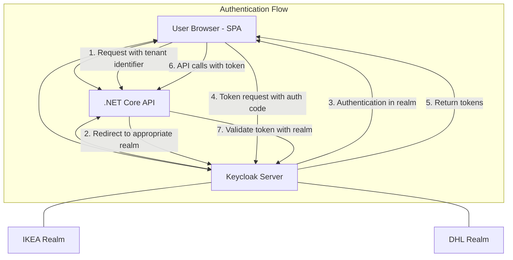
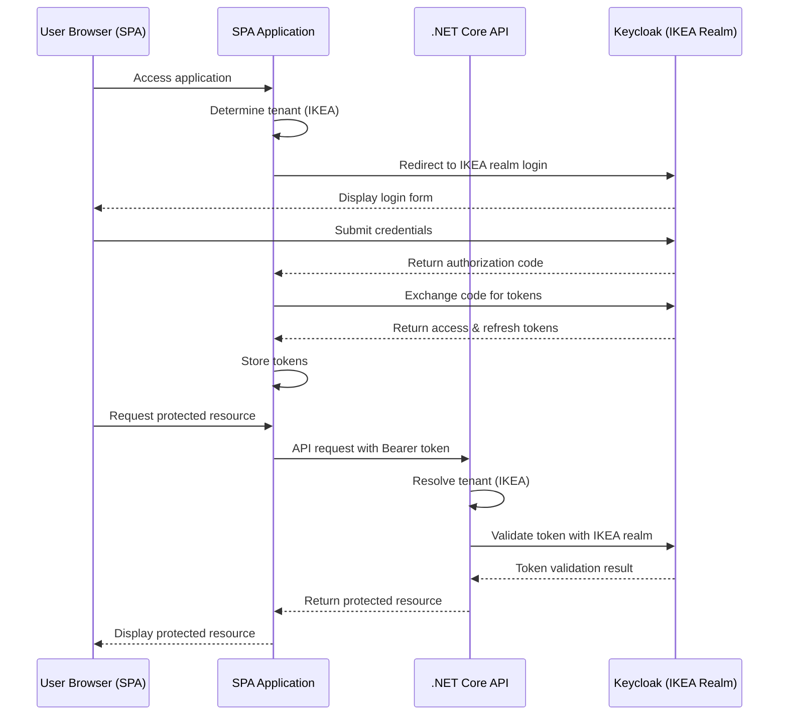

# Multi-Tenant Authentication for .NET Core with SPA Frontend using Keycloak Multi-Realm

This document outlines how to implement multi-tenant authentication in a .NET Core backend with SPA frontend application using Keycloak's multi-realm capabilities. Each tenant is represented by a separate Keycloak realm (e.g., IKEA and DHL), and the application dynamically determines which realm to use based on the tenant identifier.

---

## Overview

- **Keycloak**: Provides multi-realm identity management (one realm per tenant).
- **.NET Core Backend**: Handles authentication and authorization using OpenID Connect (OIDC).
- **SPA Frontend**: Uses OIDC client libraries to authenticate users against the appropriate Keycloak realm.
- **Tenant Resolution**: Determines the appropriate realm based on subdomain, URL path, or custom header.

---

## System Architecture

### Architecture Flowchart

Below is a Mermaid diagram of the overall architecture:



---

## Detailed Setup

### 1. Keycloak Configuration

For **each tenant realm (e.g., IKEA and DHL)**:

- **Create a Client for Backend API**:
    - **Client ID**: e.g., `dotnet-api`
    - **Protocol**: OpenID Connect
    - **Access Type**: Bearer-only (for API validation)
    - **Service Accounts Enabled**: Optional, for backend-to-backend communication

- **Create a Client for SPA**:
    - **Client ID**: e.g., `spa-client`
    - **Protocol**: OpenID Connect
    - **Access Type**: Public
    - **Standard Flow Enabled**: Yes
    - **Implicit Flow Enabled**: Optional (depends on your SPA implementation)
    - **Direct Access Grants Enabled**: Optional
    - **Root URL**: `https://app.example.com`
    - **Valid Redirect URIs**: `https://app.example.com/*`
    - **Web Origins**: `https://app.example.com` (for CORS)

- **Configure Mappers**:
    - Add mappers to include user attributes (username, email, roles).
    - Create a mapper for tenant ID if needed.

- **Assign Roles/Groups**:
    - Define realm roles (e.g., `user`, `admin`).
    - Create client roles for fine-grained permissions.
    - Assign users to appropriate roles/groups.

---

### 2. .NET Core Backend Configuration

#### 2.1 Install Required NuGet Packages

```bash
dotnet add package Microsoft.AspNetCore.Authentication.JwtBearer
dotnet add package Microsoft.AspNetCore.Authentication.OpenIdConnect
dotnet add package Microsoft.Extensions.Options.ConfigurationExtensions
```

#### 2.2 Configure Multi-Tenant Authentication

Create a tenant configuration class:

```csharp
public class TenantSettings
{
    public Dictionary<string, TenantConfig> Tenants { get; set; }
}

public class TenantConfig
{
    public string Name { get; set; }
    public string Realm { get; set; }
    public string Authority { get; set; }
    public string ClientId { get; set; }
    public string ClientSecret { get; set; } // If applicable
    public string Audience { get; set; }
}
```

Add tenant configurations to `appsettings.json`:

```json
{
  "TenantSettings": {
    "Tenants": {
      "ikea": {
        "Name": "IKEA",
        "Realm": "ikea",
        "Authority": "https://keycloak.example.com/realms/ikea",
        "ClientId": "dotnet-api",
        "Audience": "account"
      },
      "dhl": {
        "Name": "DHL",
        "Realm": "dhl",
        "Authority": "https://keycloak.example.com/realms/dhl",
        "ClientId": "dotnet-api",
        "Audience": "account"
      }
    }
  }
}
```

#### 2.3 Implement Tenant Resolution Middleware

Create middleware to determine the tenant from the request:

```csharp
public class TenantResolutionMiddleware
{
    private readonly RequestDelegate _next;
    private readonly TenantSettings _tenantSettings;

    public TenantResolutionMiddleware(RequestDelegate next, IOptions<TenantSettings> tenantSettings)
    {
        _next = next;
        _tenantSettings = tenantSettings.Value;
    }

    public async Task InvokeAsync(HttpContext context)
    {
        // Option 1: Resolve tenant from subdomain
        var host = context.Request.Host.Host;
        var tenantId = host.Split('.')[0];
        
        // Option 2: Resolve from path
        // var path = context.Request.Path.Value;
        // var tenantId = path.Split('/')[1];
        
        // Option 3: Resolve from header
        // var tenantId = context.Request.Headers["X-Tenant-ID"].FirstOrDefault();

        if (_tenantSettings.Tenants.ContainsKey(tenantId))
        {
            context.Items["TenantId"] = tenantId;
            context.Items["TenantConfig"] = _tenantSettings.Tenants[tenantId];
        }
        else
        {
            // Handle unknown tenant
            context.Response.StatusCode = 400;
            await context.Response.WriteAsync("Unknown tenant");
            return;
        }

        await _next(context);
    }
}
```

#### 2.4 Configure Authentication in Startup.cs

```csharp
public void ConfigureServices(IServiceCollection services)
{
    // Add tenant settings
    services.Configure<TenantSettings>(Configuration.GetSection("TenantSettings"));
    
    // Add authentication
    services.AddAuthentication(JwtBearerDefaults.AuthenticationScheme)
        .AddJwtBearer(options =>
        {
            options.Events = new JwtBearerEvents
            {
                OnTokenValidated = async context =>
                {
                    // Additional validation if needed
                },
                OnMessageReceived = context =>
                {
                    // Get tenant from the request
                    var tenantId = context.HttpContext.Items["TenantId"] as string;
                    var tenantConfig = context.HttpContext.Items["TenantConfig"] as TenantConfig;
                    
                    if (tenantConfig != null)
                    {
                        // Set the authority for token validation based on tenant
                        context.Options.Authority = tenantConfig.Authority;
                        context.Options.Audience = tenantConfig.Audience;
                    }
                    
                    return Task.CompletedTask;
                }
            };
        });
    
    // Add authorization policies
    services.AddAuthorization(options =>
    {
        options.AddPolicy("RequireAdminRole", policy => 
            policy.RequireRole("admin"));
    });
    
    // Add controllers and other services
    services.AddControllers();
    
    // Add CORS for SPA
    services.AddCors(options =>
    {
        options.AddPolicy("AllowSPA", builder =>
        {
            builder.WithOrigins("https://app.example.com")
                   .AllowAnyMethod()
                   .AllowAnyHeader()
                   .AllowCredentials();
        });
    });
}

public void Configure(IApplicationBuilder app, IWebHostEnvironment env)
{
    // Other middleware
    
    // Add tenant resolution middleware
    app.UseMiddleware<TenantResolutionMiddleware>();
    
    app.UseCors("AllowSPA");
    app.UseAuthentication();
    app.UseAuthorization();
    
    app.UseEndpoints(endpoints =>
    {
        endpoints.MapControllers();
    });
}
```

#### 2.5 Create a Tenant-Aware Controller

```csharp
[ApiController]
[Route("api/[controller]")]
[Authorize]
public class UserProfileController : ControllerBase
{
    [HttpGet]
    public IActionResult GetProfile()
    {
        var tenantId = HttpContext.Items["TenantId"] as string;
        var userId = User.FindFirst(ClaimTypes.NameIdentifier)?.Value;
        var username = User.FindFirst(ClaimTypes.Name)?.Value;
        
        return Ok(new
        {
            TenantId = tenantId,
            UserId = userId,
            Username = username,
            Roles = User.FindAll(ClaimTypes.Role).Select(c => c.Value)
        });
    }
    
    [HttpGet("admin")]
    [Authorize(Policy = "RequireAdminRole")]
    public IActionResult GetAdminData()
    {
        // Only accessible to users with admin role
        return Ok(new { Message = "Admin data" });
    }
}
```

---

### 3. SPA Frontend Configuration

#### 3.1 Install OIDC Client Library

For Angular:
```bash
npm install angular-oauth2-oidc
```

For React:
```bash
npm install oidc-client
```

#### 3.2 Configure OIDC Client (Angular Example)

Create an authentication service:

```typescript
import { Injectable } from '@angular/core';
import { OAuthService, AuthConfig } from 'angular-oauth2-oidc';
import { HttpClient } from '@angular/common/http';
import { BehaviorSubject } from 'rxjs';

@Injectable({
  providedIn: 'root'
})
export class AuthService {
  private tenantId: string;
  private isAuthenticatedSubject = new BehaviorSubject<boolean>(false);
  public isAuthenticated$ = this.isAuthenticatedSubject.asObservable();

  constructor(
    private oauthService: OAuthService,
    private http: HttpClient
  ) {}

  async configureTenant(tenantId: string): Promise<void> {
    this.tenantId = tenantId;
    
    // Get tenant-specific OIDC configuration
    const authConfig: AuthConfig = {
      issuer: `https://keycloak.example.com/realms/${tenantId}`,
      redirectUri: window.location.origin,
      clientId: 'spa-client',
      scope: 'openid profile email',
      responseType: 'code',
      // Other configurations...
    };
    
    this.oauthService.configure(authConfig);
    await this.oauthService.loadDiscoveryDocumentAndTryLogin();
    
    this.isAuthenticatedSubject.next(this.oauthService.hasValidAccessToken());
    
    // Setup automatic silent refresh
    this.oauthService.setupAutomaticSilentRefresh();
  }

  login(): void {
    this.oauthService.initLoginFlow();
  }

  logout(): void {
    this.oauthService.logOut();
  }

  getAccessToken(): string {
    return this.oauthService.getAccessToken();
  }

  getTenantId(): string {
    return this.tenantId;
  }
}
```

#### 3.3 Tenant Resolution in SPA

Implement tenant resolution in your app component:

```typescript
import { Component, OnInit } from '@angular/core';
import { AuthService } from './auth.service';

@Component({
  selector: 'app-root',
  template: `
    <div *ngIf="isReady">
      <app-header [isAuthenticated]="isAuthenticated" (login)="login()" (logout)="logout()"></app-header>
      <router-outlet></router-outlet>
    </div>
    <div *ngIf="!isReady">Loading...</div>
  `
})
export class AppComponent implements OnInit {
  isReady = false;
  isAuthenticated = false;

  constructor(private authService: AuthService) {
    this.authService.isAuthenticated$.subscribe(
      isAuthenticated => this.isAuthenticated = isAuthenticated
    );
  }

  async ngOnInit(): Promise<void> {
    // Option 1: Get tenant from subdomain
    const host = window.location.hostname;
    const tenantId = host.split('.')[0];
    
    // Option 2: Get from URL path
    // const path = window.location.pathname;
    // const tenantId = path.split('/')[1];
    
    // Option 3: Get from configuration or user selection
    // const tenantId = 'ikea'; // or from a service
    
    await this.authService.configureTenant(tenantId);
    this.isReady = true;
  }

  login(): void {
    this.authService.login();
  }

  logout(): void {
    this.authService.logout();
  }
}
```

#### 3.4 HTTP Interceptor for API Calls

Create an interceptor to add the access token to API requests:

```typescript
import { Injectable } from '@angular/core';
import { HttpInterceptor, HttpRequest, HttpHandler, HttpEvent } from '@angular/common/http';
import { Observable } from 'rxjs';
import { AuthService } from './auth.service';

@Injectable()
export class AuthInterceptor implements HttpInterceptor {
  constructor(private authService: AuthService) {}

  intercept(req: HttpRequest<any>, next: HttpHandler): Observable<HttpEvent<any>> {
    // Only add token for API requests
    if (req.url.startsWith('/api')) {
      const token = this.authService.getAccessToken();
      
      if (token) {
        const authReq = req.clone({
          headers: req.headers.set('Authorization', `Bearer ${token}`)
        });
        
        return next.handle(authReq);
      }
    }
    
    return next.handle(req);
  }
}
```

---

## Authentication Flow

Below is a Mermaid sequence diagram that shows the authentication flow for a user from the IKEA tenant:



---

## Tenant Switching

If your application needs to support users switching between tenants:

1. **Logout from current realm**:
   ```typescript
   authService.logout();
   ```

2. **Configure new tenant and login**:
   ```typescript
   await authService.configureTenant('dhl');
   authService.login();
   ```

---

## Summary

- **Multi-Tenant Architecture**: Each tenant has its own Keycloak realm with separate users, roles, and configurations.
- **Tenant Resolution**: Determine the tenant from subdomain, URL path, or custom header.
- **.NET Core Backend**: Dynamically configures authentication based on the resolved tenant.
- **SPA Frontend**: Configures OIDC client to use the appropriate Keycloak realm.
- **Token Handling**: Manages access tokens, refresh tokens, and API authorization.

This architecture provides a clean separation between tenants while using a single application codebase, enabling efficient multi-tenant support with proper authentication and authorization.
