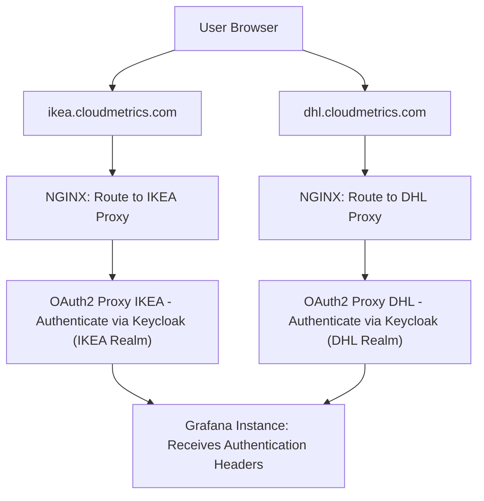
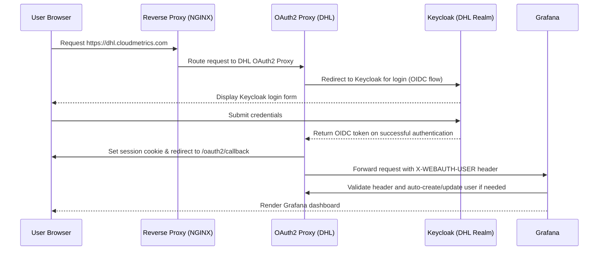

# Multi-Tenant Authentication Setup using Keycloak Multi-Realm, OAuth2 Proxy, and Grafana

This document explains how to set up a multi-tenant authentication system where each tenant is represented by a separate Keycloak realm (e.g., IKEA and DHL). 
Two separate OAuth2 Proxy instances are deployed—one per realm—and a reverse proxy (such as NGINX) routes tenant-specific subdomain requests to the correct OAuth2 Proxy instance. Finally, a single Grafana instance uses proxy headers to authenticate users.

---

## Overview

- **Keycloak**: Provides multi-realm identity management (one realm per tenant, e.g., IKEA and DHL).
- **OAuth2 Proxy**: Handles OpenID Connect (OIDC) authentication for each Keycloak realm.
- **Reverse Proxy (NGINX)**: Routes requests from tenant-specific subdomains (e.g., `ikea.cloudmetrics.com` and `dhl.cloudmetrics.com`) to the respective OAuth2 Proxy instances.
- **Grafana**: A single instance that accepts user authentication via the headers set by the OAuth2 Proxies.

---

## System Architecture

### Architecture Flowchart

Below is a Mermaid diagram of the overall architecture:



---

## Detailed Setup

### 1. Keycloak Configuration

For **each tenant realm (IKEA and DHL)**:

- **Create a Client**:
    - **Client ID**: e.g., `grafana-client`
    - **Protocol**: OpenID Connect
    - **Access Type**: Confidential
    - **Redirect URI**:
        - IKEA: `https://ikea.cloudmetrics.com/oauth2/callback`
        - DHL: `https://dhl.cloudmetrics.com/oauth2/callback`
- **Configure Mappers**:
    - Add mappers to include user attributes (username, email, roles).
- **Assign Roles/Groups**:
    - Define and assign roles as needed for your applications.

---

### 2. OAuth2 Proxy Configuration

Deploy two separate OAuth2 Proxy instances—one for each realm.

#### IKEA OAuth2 Proxy

```bash
oauth2-proxy \
  --provider=keycloak-oidc \
  --client-id=grafana-client \
  --client-secret=<IKEA_CLIENT_SECRET> \
  --redirect-url=https://ikea.cloudmetrics.com/oauth2/callback \
  --oidc-issuer-url=https://keycloak.example.com/realms/IKEA \
  --email-domain=* \
  --upstream=http://grafana:3000/ \
  --cookie-secret=<RANDOM_STRING> \
  --http-address=0.0.0.0:4180
```

#### DHL OAuth2 Proxy

```bash
oauth2-proxy \
  --provider=keycloak-oidc \
  --client-id=grafana-client \
  --client-secret=<DHL_CLIENT_SECRET> \
  --redirect-url=https://dhl.cloudmetrics.com/oauth2/callback \
  --oidc-issuer-url=https://keycloak.example.com/realms/DHL \
  --email-domain=* \
  --upstream=http://grafana:3000/ \
  --cookie-secret=<RANDOM_STRING> \
  --http-address=0.0.0.0:4181
```

*Note:* Be sure to deploy these so that they are distinguishable (for example, by listening on different ports).

---

### 3. Reverse Proxy (NGINX) Setup

Configure your reverse proxy to route requests based on the subdomain:

```nginx
server {
    listen 80;
    server_name ikea.cloudmetrics.com;

    location / {
        proxy_pass http://localhost:4180;  # Routes to IKEA OAuth2 Proxy
        proxy_set_header Host $host;
        proxy_set_header X-Real-IP $remote_addr;
    }
}

server {
    listen 80;
    server_name dhl.cloudmetrics.com;

    location / {
        proxy_pass http://localhost:4181;  # Routes to DHL OAuth2 Proxy
        proxy_set_header Host $host;
        proxy_set_header X-Real-IP $remote_addr;
    }
}
```

---

### 4. Grafana Configuration

Edit your `grafana.ini` file to enable the proxy authentication and trust the headers provided by the OAuth2 Proxies:

```ini
[auth.proxy]
enabled = true
header_name = X-WEBAUTH-USER
header_property = username
auto_sign_up = true
whitelist = 127.0.0.1, ::1
# Optionally map additional headers (e.g., name, email, groups)
headers = Name:X-WEBAUTH-NAME Email:X-WEBAUTH-EMAIL Groups:X-WEBAUTH-GROUPS
```

Grafana will now accept the `X-WEBAUTH-USER` header set by the OAuth2 Proxies to authenticate users and auto-create user accounts if necessary.

---

## Authentication Flow

Below is a Mermaid sequence diagram that shows the authentication flow for a first-time login by a user from DHL:



---

## Summary

- **DNS & Subdomains**: Direct users to tenant-specific subdomains (e.g., `ikea.cloudmetrics.com` and `dhl.cloudmetrics.com`).
- **Reverse Proxy**: Routes traffic to the corresponding OAuth2 Proxy instance.
- **OAuth2 Proxy Instances**: Each configured for a separate Keycloak realm (IKEA and DHL).
- **Grafana**: Configured to trust authentication headers from the proxies, enabling auto-signup and SSO.

This architecture maintains tenant isolation while offering a single entry point to the Grafana instance, with each tenant's authentication flow handled separately by its own OAuth2 Proxy.


