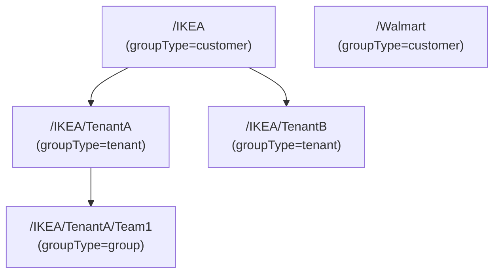
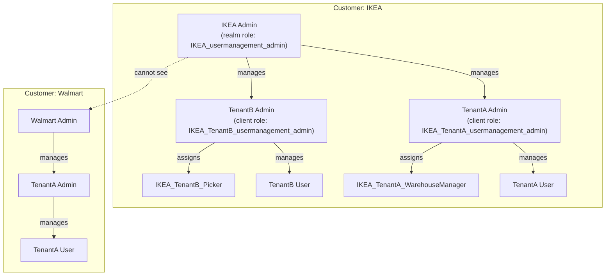

# Technical Documentation: Modeling Multitenancy in Keycloak

This document describes how Keycloak's core concepts—**groups**, **clients**, and **client roles**—are used to implement the multitenancy requirements outlined in the product requirements document.

---

## 1. Group Hierarchy: Customers and Tenants

Keycloak **groups** are used to represent both customers and their tenants, leveraging the group hierarchy to model organizational structure.

- **Customer Groups**: Top-level groups, one per customer (e.g., `/IKEA`, `/Walmart`).  
  **Important:** Customer groups are *never* assigned any roles (realm or client roles). They exist solely to model the scoping hierarchy for multilevel multitenancy.
- **Tenant Groups**: Subgroups under each customer, one per tenant (e.g., `/IKEA/TenantA`, `/IKEA/TenantB`).  
  **Important:** Tenant groups are *never* assigned any roles. They are only used for scoping and isolation.
- **Other Groups (Ordinary User Groups)**: Arbitrary subgroups (e.g., teams, departments) can be created under tenants and customers.  
  Only these ordinary user groups (with `groupType=group`) can be assigned roles.

A custom group attribute `groupType` is used to distinguish between:
- `customer` (top-level group)
- `tenant` (subgroup under customer)
- `group` (arbitrary user group)

**Strict Hierarchy Rules:**
- Customer and tenant groups are strictly for modeling the scoping hierarchy and *must not* be assigned any roles.
- Realm roles and client roles can only be assigned to users or ordinary user groups (`groupType=group`).
- Customer groups *cannot* be made children of ordinary user groups; customer groups are always at the top of the hierarchy. Examples for valid relations: 
  - customer -> tenant -> user group 
  - customer -> user group 
  - customer -> user group -> user group 

**Mermaid Diagram: Group Hierarchy**

---

## 2. Clients and Client Roles

- **Clients** represent applications (e.g., `ComplexApp`, `SimpleApp`).
- **Client Roles** are used for application-specific permissions, especially for tenants.

### Dynamic Role Creation

- **Tenant groups** are the main entry point for programmatic client role creation.
- When a new tenant group is created, the system (or an application like ComplexApp) can dynamically create client roles for that tenant.
- **Naming Convention**: Roles are named using the pattern `<Customer>_<Tenant>_<RoleName>`, e.g., `IKEA_TenantA_WarehouseManager`.

**Assignment Rules:**
- Roles (realm or client) can *only* be assigned to users or ordinary user groups (`groupType=group`).
- Customer and tenant groups are *never* assigned any roles, even for admin or scoping purposes.

### Automatic Admin Role

- Every tenant group automatically receives a `usermanagement_admin` client role (e.g., `IKEA_TenantA_usermanagement_admin`).
- This role is assigned to users or ordinary user groups who should have admin rights within the tenant, *not* to the tenant group itself.

---

## 3. Scoping and API Access

- **Customer Groups** are the primary mechanism for scoping and isolation.
    - All resources (users, groups, roles) are strongly isolated by customer.
    - Admin users of one customer cannot see or manage resources of another customer.
- **Tenant Group Admins**:
    - Users assigned the tenant's `usermanagement_admin` role gain restricted access to users and roles within their tenant.
    - They cannot access or manage resources outside their tenant.

**Mermaid Diagram: Scoping and Access**

---

## 4. Role Assignment and Coupling

- **Tenant roles are not directly assigned to tenant groups**.
    - Instead, roles are loosely coupled to tenants via naming conventions.
    - This allows for flexible assignment of roles to users or groups as needed.
- **Role Assignment**:
    - Users can be assigned roles directly or via group membership.
    - Permissions are inherited through group hierarchy.

---

## 5. Summary Table

| Concept                | Keycloak Feature | Example Name / Value                  | Notes                                                      |
|------------------------|------------------|---------------------------------------|------------------------------------------------------------|
| Customer               | Group            | `/IKEA` (groupType=customer)          | Top-level group, strong isolation. **Never assigned roles** |
| Tenant                 | Group            | `/IKEA/TenantA` (groupType=tenant)    | Subgroup under customer, entry point for role creation. **Never assigned roles** |
| Application            | Client           | `ComplexApp`                          | Represents an application                                  |
| Tenant Role            | Client Role      | `IKEA_TenantA_WarehouseManager`       | Created dynamically, not directly assigned to group        |
| Tenant Admin Role      | Client Role      | `IKEA_TenantA_usermanagement_admin`   | Automatically created for each tenant                      |
| Group Type Attribute   | Group Attribute  | `groupType=customer|tenant|group`     | Used to distinguish group purpose                          |
| Scoping/Isolation      | Group Hierarchy  | N/A                                   | Enforced via customer group boundaries. **Customer/tenant groups cannot be children of ordinary user groups** |

---

## 6. Key Points

- **Groups** model the customer/tenant hierarchy and provide the basis for scoping and isolation.
- **groupType** attribute distinguishes between customers, tenants, and other groups.
- **Customer and tenant groups are strictly for scoping**:  
  - They must *never* be assigned any roles (realm or client roles).
  - They are not used for direct permission assignment, only for modeling the multitenancy hierarchy.
  - They cannot be made children of ordinary user groups.
- **Only users and ordinary user groups** (`groupType=group`) can be assigned roles.
- **Tenant groups** are the main entry point for programmatic client role creation.
- **Tenant admin roles** are automatically created and assigned to users or ordinary user groups to enable delegated administration.
- **Scoping** is enforced primarily via customer groups, ensuring strong isolation.
- **Tenant group admins** have restricted access to users and roles within their tenant.
- **Tenant roles** are loosely coupled to tenant groups via naming conventions, not direct assignment.

---

## 7. Strict Separation of Scoping Groups and Role Assignment

To ensure robust multitenancy and prevent privilege escalation, the following rules must always be enforced:

- **Customer and tenant groups are never assigned any roles** (neither realm roles nor client roles).
- **Roles can only be assigned to users or ordinary user groups** (`groupType=group`).
- **Customer and tenant groups cannot be made children of ordinary user groups**; the hierarchy is always:  
  `customer group → tenant group → ordinary user group (optional)`.
- This separation ensures that the scoping hierarchy (customers/tenants) is used only for isolation and delegation, while permissions and access control are managed exclusively through users and ordinary user groups.

---
